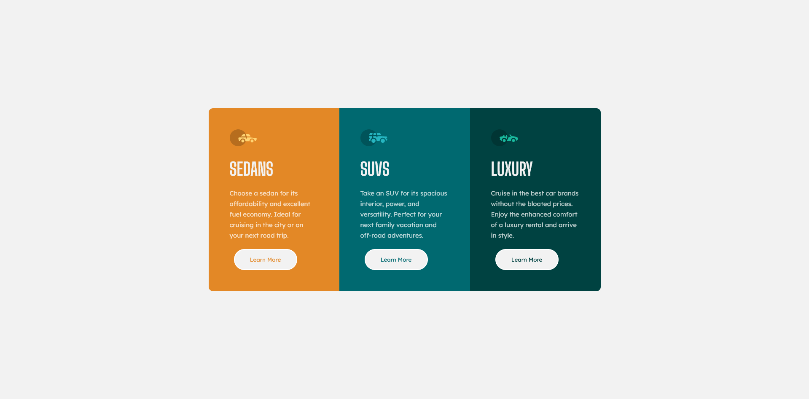

# Frontend Mentor - 3-column preview card component solution

This is a solution to the [3-column preview card component challenge on Frontend Mentor](https://www.frontendmentor.io/challenges/3column-preview-card-component-pH92eAR2-). Frontend Mentor challenges help you improve your coding skills by building realistic projects. 

## Table of contents

- [Overview](#overview)
  - [The challenge](#the-challenge)
  - [Screenshot](#screenshot)
  - [Links](#links)
- [My process](#my-process)
  - [Built with](#built-with)
  - [What I learned](#what-i-learned)
  - [Continued development](#continued-development)
  - [Useful resources](#useful-resources)
- [Author](#author)

## Overview

### The challenge

Users should be able to:

- View the optimal layout depending on their device's screen size
- See hover states for interactive elements

### Screenshot

### Links

- Solution URL: ([https://your-solution-url.com](https://github.com/CharlieeLuna23/3-column-preview-card.git))
- Live Site URL: ([https://your-live-site-url.com](https://charlieeluna23.github.io/3-column-preview-card/))

## My process

### Built with

- Semantic HTML5 markup
- CSS custom properties
- Flexbox
- CSS Grid
- Mobile-first workflow

### What I learned

I learned a way to have interactive buttons and practiced flexbox to adapt the content to different screens.

### Continued development

more easily identify what attribute I need to work with so I can be more efficient with my work.

### Useful resources

- [Example resource 1](https://www.youtube.com/watch?v=2Wy_MJPDfCw&ab_channel=tsbsankara) - This helped me to complete the interactive button and just that, I swear :)

## Author

- FreeCodeCamp - [CharlieeLuna](https://www.freecodecamp.org/CharlieeLuna)
- Frontend Mentor - [@CharlieeLuna23](https://www.frontendmentor.io/profile/CharlieeLuna23)

